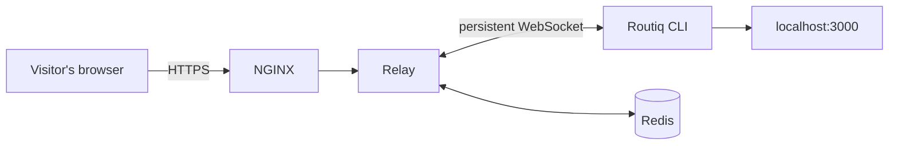

<div align="center">

<h1>
  
  Routiq
</h1>

### Expose localhost to the internet — in one command.

[](https://www.npmjs.com/package/routiq)
[](LICENSE)
[](https://www.typescriptlang.org/)

[routiq.dev](https://routiq.dev) · [Docs](https://routiq.dev/docs) · [npm](https://www.npmjs.com/package/routiq)

</div>

<br />


## What is this?

Routiq gives a local dev server a public HTTPS URL in seconds — no config files, no dashboards, no deploy pipeline. Point the CLI at a port, get a link, share it with anyone.

```bash
npm install -g routiq
routiq login
routiq http 3000
```

This repo is the whole system: the CLI, the WebSocket relay it talks to, the dashboard, and everything in between.


## How it works



The CLI opens a WebSocket to the relay and registers a tunnel. Every HTTP request that hits the tunnel's public URL gets forwarded over that socket to the CLI, which proxies it to your local port and streams the response back. Redis tracks tunnel ownership so requests can be routed correctly even across multiple relay instances.

## Project structure

This is a pnpm/Turborepo monorepo:

| Path | Package | What it is |
|---|---|---|
| `apps/cli` | `routiq` | The published CLI — what `npm install -g routiq` installs |
| `apps/agent` | `@routiq/agent` | WebSocket client library the CLI uses to talk to the relay |
| `apps/relay` | `@routiq/relay` | The relay server — Fastify + `ws`, backed by Redis |
| `apps/web` | `@routiq/web` | Marketing site, docs, auth, and API key management (Next.js) |
| `packages/shared` | `@routiq/shared` | Shared TypeScript message/type definitions |

## Local development

```bash
pnpm install

# start Redis
docker compose up -d redis

# run everything
pnpm dev
```

Individual apps can be run on their own too, e.g. `pnpm --filter @routiq/relay dev` or `pnpm --filter @routiq/web dev`. See `apps/relay/.env.example` and `apps/cli/.env.example` for local configuration.

For running two relay instances behind NGINX locally (to test cross-relay forwarding), see `docker compose --profile multi-relay up`.

## Deployment

- **Web** — deployed on Vercel, root directory `apps/web`.
- **Relay** — deployed via Docker Compose on a VPS (`docker compose --profile prod up -d --build`), fronted by NGINX with a Let's Encrypt certificate covering the wildcard tunnel domain. See `deploy/` and `nginx/` for the full setup.
- **CLI** — published to npm from `apps/cli` (`pnpm run publish:cli`).

## Contributing

Issues and PRs are welcome. If you're proposing a larger change, opening an issue first to discuss it is appreciated.

## License

MIT © [Ayush Sharma](https://github.com/ayush844)
